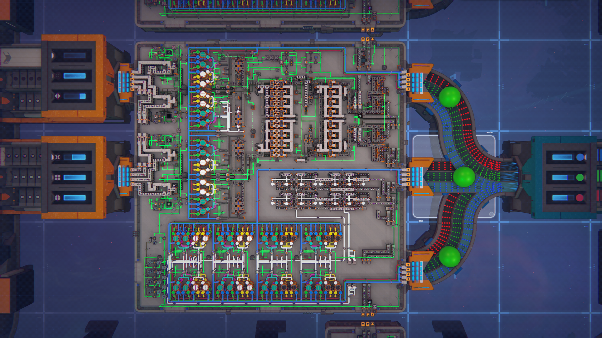

# 层叠式CMAM
* 1×4满带
* 单层占地3×3
* 不能制作类型：单层有不同颜色水晶，水晶本层和下层有空隙

## CMAM单元展示

  

* 一个CMAM单元制作最上层图形，并把下层图形交给上方的CMAM单元制作
如果要4层图形，从下往上串联4个CMAM单元，并在右下方提供图形信号输入
* 左侧输入基础图形，每层不同，最大需求每种图形1×4满带
* 右侧输入基础颜色，每层不同，最大需求每种颜色3×4满带

## 施工中
